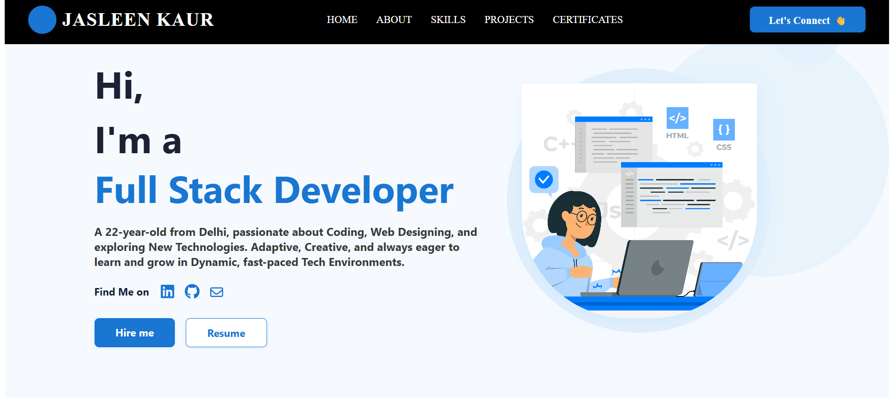
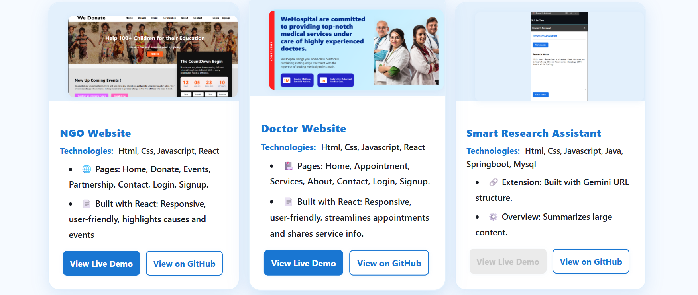
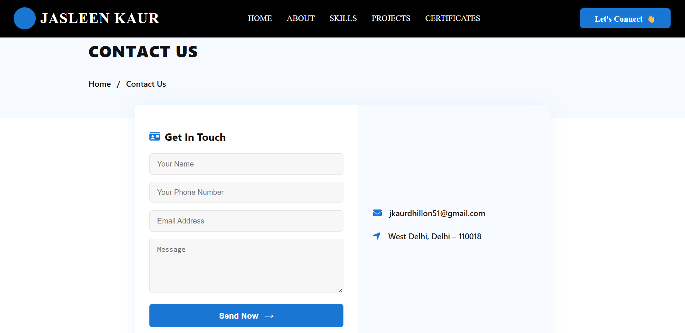

# Personal Portfolio 💼

A full-stack personal portfolio website built using React, Node.js, Express, and MySQL.  
Showcases projects, contact form, resume download and more — designed to highlight skills and experience for job applications.

---

### 🌟 Features

- 🎨 Clean and professional portfolio showcasing skills and projects  
- 🚀 Fast loading with optimized React components  
- 🔒 Secure contact form with data validation  
- 📊 Tracks visitor interactions with backend APIs  
- ⚙️ Easy to customize and extend for personal branding  

---

### 🔧 Tech Stack

- Frontend: React.js, JavaScript (ES6+), CSS, HTML  
- Backend: Node.js, Express.js, REST API development  
- Database: MySQL for storing contact form submissions  
- Development Tools: VS Code, Postman, Git/GitHub  
- Deployment: Netlify (frontend), Render (backend)

---

### 🚀 Getting Started

To run the project locally:

```bash
git clone https://github.com/Jasleen-Kaur-123/personal-portfolio.git
cd ../client                        # for frontend
npm install
npm start

cd personal-portfolio/server        # for backend
npm install
node main.js                        # or your entry file name
````

### 📸 Screenshots

**PORTFOLIO Home Page**  


**PORTFOLIO Project Page**  


**PORTFOLIO Contact Page**  

